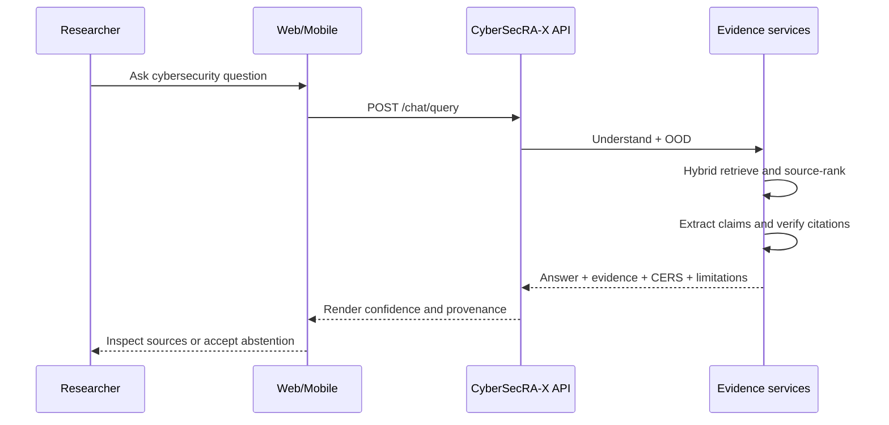

# Demonstration workflow

```mermaid
sequenceDiagram
  participant U as Researcher
  participant W as Web/Mobile
  participant API as CyberSecRA-X API
  participant E as Evidence services
  U->>W: Ask cybersecurity question
  W->>API: POST /chat/query
  API->>E: Understand + OOD
  E->>E: Hybrid retrieve and source-rank
  E->>E: Extract claims and verify citations
  E-->>API: Answer + evidence + CERS + limitations
  API-->>W: Render confidence and provenance
  W-->>U: Inspect sources or accept abstention
```
